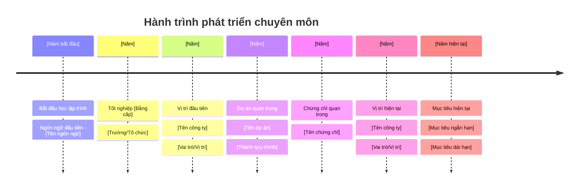
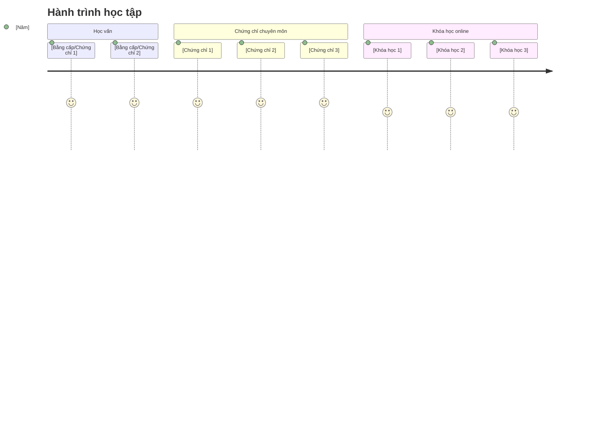
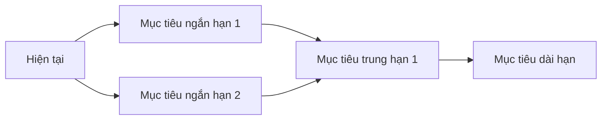

# 👋 Xin chào, tôi là [Tên của bạn]

## 🚀 Về tôi

Tôi là một người đam mê công nghệ thông tin, hiện đang phát triển kỹ năng và kiến thức trong lĩnh vực [lĩnh vực chuyên môn của bạn: phát triển web/AI/data science/...]. Với niềm đam mê khám phá và học hỏi không ngừng, tôi luôn tìm kiếm cơ hội để phát triển bản thân và đóng góp vào cộng đồng công nghệ.

- 🔭 Hiện tại tôi đang làm việc tại: **[Công ty/Tổ chức của bạn]**
- 🌱 Tôi đang học: **[Công nghệ/Ngôn ngữ bạn đang học]**
- 👯 Tôi muốn cộng tác về: **[Lĩnh vực bạn muốn hợp tác]**
- 💬 Hãy hỏi tôi về: **[Những chủ đề bạn có thể giúp đỡ người khác]**
- 📫 Liên hệ với tôi: **[email@example.com]**
- ⚡ Sở thích: **[Sở thích ngoài công nghệ]**

## 📈 Hành trình phát triển của tôi

## 🛠️ Kỹ năng & Công nghệ

### Ngôn ngữ lập trình

### Frontend

### Backend

### Cơ sở dữ liệu

### DevOps & Công cụ

## 🎓 Học vấn & Chứng chỉ

## 💼 Kinh nghiệm làm việc

### **[Năm] - Hiện tại**: [Vị trí hiện tại] tại [Công ty hiện tại]

- [Thành tựu hoặc trách nhiệm chính 1]
- [Thành tựu hoặc trách nhiệm chính 2]
- [Thành tựu hoặc trách nhiệm chính 3]
- **Công nghệ sử dụng:** [Danh sách công nghệ]

### **[Năm] - [Năm]**: [Vị trí trước đây] tại [Công ty trước đây]

- [Thành tựu hoặc trách nhiệm chính 1]
- [Thành tựu hoặc trách nhiệm chính 2]
- **Công nghệ sử dụng:** [Danh sách công nghệ]

### **[Năm] - [Năm]**: [Vị trí đầu tiên] tại [Công ty đầu tiên]

- [Thành tựu hoặc trách nhiệm chính 1]
- [Thành tựu hoặc trách nhiệm chính 2]
- **Công nghệ sử dụng:** [Danh sách công nghệ]

## 🚀 Dự án nổi bật

### [Năm] - [Tên dự án 1](https://github.com/yourusername/project1)

Mô tả ngắn gọn về dự án, các công nghệ sử dụng và vai trò của bạn trong dự án.

### [Năm] - [Tên dự án 2](https://github.com/yourusername/project2)

Mô tả ngắn gọn về dự án, các công nghệ sử dụng và vai trò của bạn trong dự án.

## 📝 Blog & Viết lách

### [Năm] - [Tiêu đề bài viết 1](https://example.com/article1)
Mô tả ngắn gọn về nội dung bài viết và các chủ đề chính.

### [Năm] - [Tiêu đề bài viết 2](https://example.com/article2)
Mô tả ngắn gọn về nội dung bài viết và các chủ đề chính.

### [Năm] - [Tiêu đề bài viết 3](https://example.com/article3)
Mô tả ngắn gọn về nội dung bài viết và các chủ đề chính.

## 📊 GitHub Stats

## 🌟 Lời khuyên cho người mới học CNTT

1. **Học từ nền tảng**: Đừng bỏ qua kiến thức cơ bản. Hiểu rõ các nguyên lý nền tảng sẽ giúp bạn tiến xa hơn.
2. **Thực hành thường xuyên**: Lập trình là kỹ năng thực hành. Hãy code mỗi ngày, dù chỉ là một bài tập nhỏ.
3. **Xây dựng dự án thực tế**: Áp dụng kiến thức vào các dự án thực tế sẽ giúp bạn hiểu sâu hơn và có portfolio ấn tượng.
4. **Tham gia cộng đồng**: Kết nối với những người cùng đam mê, tham gia các diễn đàn như Stack Overflow, GitHub, Reddit.
5. **Học liên tục**: Công nghệ luôn thay đổi, hãy cập nhật kiến thức thường xuyên và sẵn sàng học hỏi suốt đời.

## 📫 Kết nối với tôi

## 🎯 Mục tiêu tương lai

---

> "Học tập không phải là đích đến, mà là một hành trình suốt đời." - Ralph Waldo Emerson

⭐️ From [yourusername](https://github.com/yourusername)